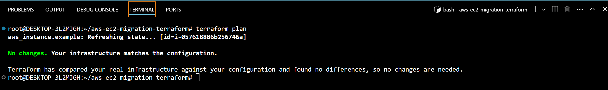

# aws-ec2-migration-terraform


In this article, we will migrate an existing EC2 instance created through the AWS management console to Terraform. **Why the migration?** 
Migrating AWS resources to Terraform brings consistency, automation, and scalability by defining infrastructure as code. It ensures reproducibility, simplifies disaster recovery and allows change tracking, making it easier to collaborate and manage resources efficiently.


So to begin, we will first write a ``` main.tf ``` file and within the ``` main.tf ``` file we will have the provider configuration and the import block as you can see below. 

```
provider "aws" {
  region = "us-east-1"
}

import {
  id = "i-057618886b256746a"

  to = aws_instance.example
}
```

In the import block, I have provided the instance ID of the existing instance. Terraform will look up the instance with that particular ID and retrieve the entire resource configuration to **aws_instance.example**.


Run ````terraform init``` to initialize terraform and then ``` terraform plan -generate-config-out =generated_resources.tf ``` to generate configuration files for the existing resource that Terraform will manage. 

A new Terraform file, **generated_resources.tf**, has been created, containing all the details related to the EC2 instance. Since you now have the resource code, you can copy the entire block from **generated_resources.tf** and replace the import block with it. You can go ahead and delete the ** generated_resources.tf** file.

If you run ``` terraform plan ``` terraform still does not recognize that the resource already exists, it will try and create a new resource as you can see below. This happens because we do not have a ** terraform state file ** this is because the EC2 was created through the management console. A state file records the details of the resources that are created and managed by Terraform.


We need to run the command terraform import aws_instance.example <Instance ID>, replacing <Instance ID> with the ID of your existing EC2 instance. This command will create or update the Terraform state file to include the details of the EC2 instance.

When you run ```terraform plan``` again, terraform will recognize that the resource already exists.




We successfully moved an existing EC2 instance from the AWS Management Console to Terraform. This change helps manage infrastructure better by keeping everything organized in code. By importing the instance, we created a state file that lets Terraform track our resources, making it easier to automate updates and manage configurations. Overall, this migration sets us up for smoother operations in the future, allowing us to handle more resources efficiently and work together more effectively.
